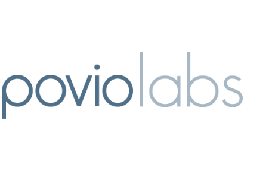

<p align="center">
  
</p>

# PovioKit

[](https://cocoapods.org/pods/PovioKit)
[](https://cocoapods.org/pods/PovioKit)
[](https://cocoapods.org/pods/PovioKit)

Welcome to **PovioKit**, a modular collection of cocoapods libraries, written in Swift.

## List of available libraries

### Extensions
* [UICollectionView](/PovioKit/Classes/Extensions/UIKit/UICollectionView+Povio.swift)
* [UITableView](/PovioKit/Classes/Extensions/UIKit/UITableView+Povio.swift)
* [UIView](/PovioKit/Classes/Extensions/UIKit/UIView+Povio.swift)
* [UIColor](/PovioKit/Classes/Extensions/UIKit/UIColor+Povio.swift)
* [Collection](/PovioKit/Classes/Extensions/Foundation/Collection+Povio.swift)
* [String](/PovioKit/Classes/Extensions/Foundation/String+Povio.swift)
* [URL](/PovioKit/Classes/Extensions/Foundation/URL+Povio.swift)

### Utilities
* [AttributedStringBuilder](/PovioKit/Classes/Utilities/AttributedStringBuilder/)
* [StartupService](/PovioKit/Classes/Utilities/StartupService/)
* [Broadcast](/PovioKit/Classes/Utilities/Broadcast/)

## Installation

PovioKit is available through [CocoaPods](https://cocoapods.org). To install
it, simply add the following line to your Podfile:

```ruby
pod 'PovioKit'
```

This way you'll install all subspecs available. However, you could option in to install only selected subspec. Her is an example how to install `StartupService`:

```ruby
pod 'PovioKit/Utilities/StartupService'
```

## Example

To run the example project, clone the repo, and run `pod install` from the Example directory first.


## License

PovioKit is available under the MIT license. See the LICENSE file for more info.
