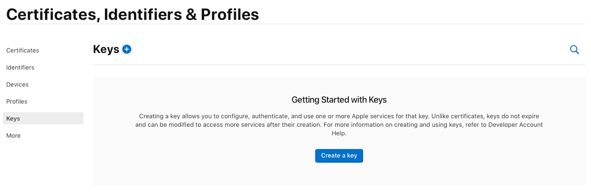
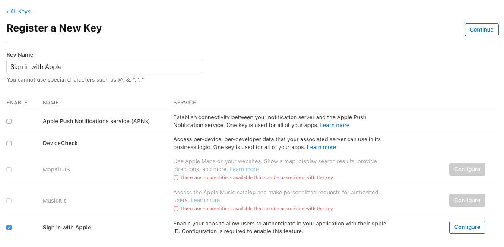

# AppleAuthenticator

Auth provider for social login with Apple.

## Setup
- Open the `Signing & Capabilities` section in **Xcode** target and add `Sign in with Apple` entitlement.
- Navigate to the `Certificates, Identifiers & Profile` section under **Apple Developer** portal, select `Keys` from side menu and create a new key.

- Type in the name like "Sign in with Apple" and select `Sign in with Apple` checkbox

- When integration with Firebase (or any other auth provider as such) you’ll need to create a random string called `nonce` when creating authorization request.
- Integration with custom API is a bit more challenging since you need to create rest call to Apple servers and handle tokenization yourself. You can read more about this [here](https://developer.apple.com/documentation/signinwithapplerestapi).

Please read [official documentation](https://developer.apple.com/sign-in-with-apple/get-started/) from Apple for more details around the setup and integration.

## Usage

```swift
// initialization
let authenticator = AppleAuthenticator() // conforms to `AppleAuthProvidable` protocol

// signIn user
authenticator
  .signIn(from: <view-controller-instance>)
  .finally {
    // handle result
  }
  
// signIn user with nonce
authenticator
  .signIn(from: <view-controller-instance>, with: .random(length: 32))
  .finally {
    // handle result
  }

// get auth status
authenticator
  .checkAuthState()
  .finally {
    // check result
  }

// signOut user
authenticator.signOut() // all provider data regarding the use auth is cleared at this point
```
